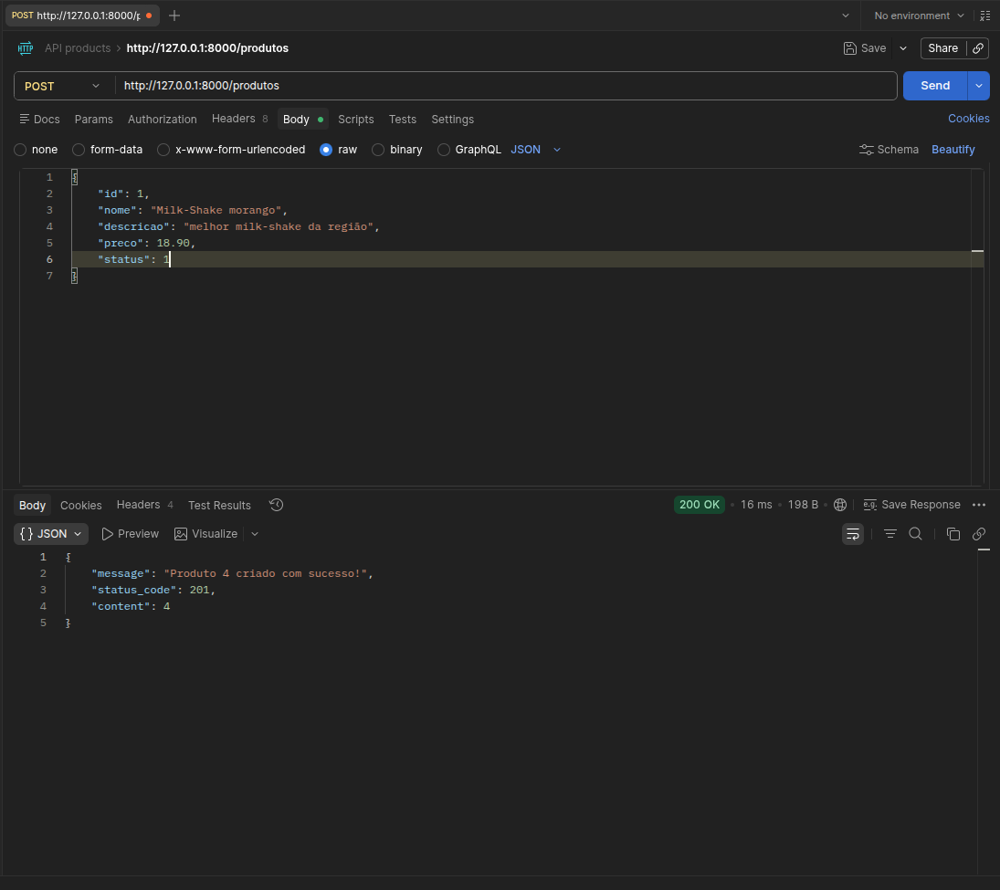

# API Python Produtos
API para gerenciamento de produtos construída com FastAPI, seguindo princípios de arquitetura REST e separação em camadas.
## 🚀 Status


## Preview


## Tecnologias
- Python 3.x
- FastAPI
- SQLite
- Uvicorn

## Como rodar

### Pré-requisitos
- Python 3.x
- pip

### Passos
```bash
git clone <repo>
cd <repo>
python -m venv venv

# Windows - CMD
venv\Scripts\activate
#####################

# Windows - PowerShell
venv\Scripts\Activate.ps1
#####################

# Linux
source venv/bin/activate
########################

# com o venv ATIVO:
pip install -r requirements.txt
uvicorn main:app --reload
```

## Estrutura
```
api-python-produtos/
│── controllers/ -> define as rotas da API
│   └── produto_controller.py
│── models/ -> Define a estrutura das entidades do banco de dados.
│   └── produto_model.py
│── repositories/ -> acesso ao banco de dados
│   └── produto_repository.py
│── schemas/ -> Valida a serialização (Pydantic)
│   └── produto_schema.py
│── services/ -> regras de negócio
│   └── produto_service.py
│── main.py
│── produtos_database.py
│── produtos.db
│── README.md
│── requirements.txt
```


## Funcionalidades
- Criar Produto
- Listar Produto
- Buscar produto pelo ID
- Atualizar Produto
- Deletar Produto

## Endpoints

### GET /produtos
Listar todos os produtos

### GET /produtos/{id}
Buscar produto com base no ID dele

### POST /produtos
Criar um novo produto

### PUT /produtos/{id}
Atualiza um produto

### DELETE /produtos/{id}
Deleta um produto

## Autor
### Icaro Santos
[](https://github.com/IcaroSantos21)
[](https://www.linkedin.com/in/icarorod21/)

